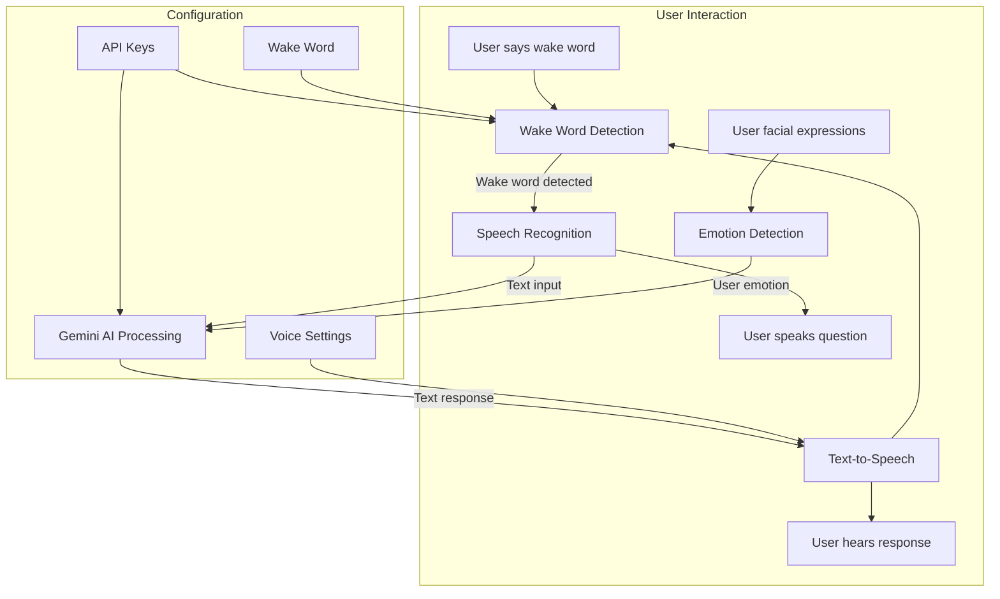

# Conversation Robot

A smart conversational robot that listens for a wake word, processes your speech, and responds using Gemini AI and high-quality text-to-speech. Now with advanced emotion detection using FER (Facial Emotion Recognition)!

## How It Works



## Features

- Wake word detection using Porcupine
- Speech recognition using Google's Speech Recognition API
- AI-powered responses using Google's Gemini AI
- High-quality text-to-speech using ElevenLabs (with pyttsx3 as fallback)
- Advanced emotion detection using FER (Facial Emotion Recognition)
- Emotion-aware AI responses that adapt to the user's emotional state
- Conversation history saving

## Requirements

- Python 3.8+
- Microphone and speakers
- Webcam for emotion detection
- Porcupine access key (for wake word detection)
- Gemini API key
- ElevenLabs API key (optional, for high-quality TTS)

## Installation

1. Clone this repository:
   ```
   git clone https://github.com/yourusername/conversation-robot.git
   cd conversation-robot
   ```

2. Install the required packages:
   ```
   pip install -r requirements.txt
   ```

3. Create a `.env` file in the root directory with your API keys:
   ```
   PORCUPINE_ACCESS_KEY=your_porcupine_access_key_here
   GEMINI_API_KEY=your_gemini_api_key_here
   ELEVENLABS_API_KEY=your_elevenlabs_api_key_here
   ```

   You can use the `env.example` file as a template.

   Optional environment variables:
   ```
   WAKE_WORD=custom_wake_word
   SAVE_HISTORY=true
   USE_ELEVENLABS=true
   ELEVENLABS_VOICE_ID=EXAVITQu4vr4xnSDxMaL
   ELEVENLABS_STABILITY=0.5
   ELEVENLABS_SIMILARITY=0.75
   VOICE_ID=0
   VOICE_RATE=150
   VOICE_VOLUME=0.8
   LIST_VOICES=true
   ```

## Getting API Keys

- **Porcupine Access Key**: Sign up at [Picovoice Console](https://console.picovoice.ai/) to get a free access key
- **Gemini API Key**: Get your API key from [Google AI Studio](https://makersuite.google.com/app/apikey)
- **ElevenLabs API Key**: Sign up at [ElevenLabs](https://elevenlabs.io/) to get an API key

## Usage

### Full Conversation Robot

Run the conversation robot with wake word detection:

```
python conversation_robot.py
```

The robot will start listening for the wake word "hey robot". Once detected, it will listen for your question, process it using Gemini AI, and speak the response back to you.

### Emotion Detection

The robot uses the FER (Facial Emotion Recognition) library to detect emotions from your facial expressions via webcam. This emotion information is sent to the Gemini AI model to provide more contextually appropriate and emotionally intelligent responses.

The robot can detect the following emotions:
- Happy
- Sad
- Angry
- Neutral
- Fear
- Surprise
- Disgust

The AI will adapt its responses based on your detected emotional state, providing more supportive, encouraging, or calming responses as appropriate.

### Test Mode (No Wake Word)

For testing or if you don't have a microphone, you can use the test script:

```
python test_conversation.py
```

This allows you to type your messages directly and get spoken responses from the AI without needing wake word detection or speech recognition.

## Customization

### Wake Word

You can customize the wake word by passing it to the ConversationRobot constructor:

```python
robot = ConversationRobot(wake_word="computer")
```

Or set it in your `.env` file:

```
WAKE_WORD=computer
```

### Text-to-Speech Options

#### ElevenLabs (High-Quality TTS)

By default, the robot uses ElevenLabs for high-quality text-to-speech. You can customize it with these settings:

```
USE_ELEVENLABS=true
ELEVENLABS_VOICE_ID=EXAVITQu4vr4xnSDxMaL  # Default is "Rachel"
ELEVENLABS_STABILITY=0.5      # Voice stability (0.0-1.0)
ELEVENLABS_SIMILARITY=0.75    # Voice similarity boost (0.0-1.0)
```

To see a list of available ElevenLabs voices, run:

```
LIST_VOICES=true python conversation_robot.py
```

#### Local TTS (pyttsx3)

If you don't have an ElevenLabs API key or prefer to use local TTS, you can disable ElevenLabs:

```
USE_ELEVENLABS=false
```

Then customize the local TTS with:

```
VOICE_ID=0           # Voice ID or index number
VOICE_RATE=150       # Speech rate (default is 200, lower is slower)
VOICE_VOLUME=0.8     # Volume from 0.0 to 1.0
```

### Conversation History

The robot can save conversation history to JSON files. Enable this feature by setting:

```
SAVE_HISTORY=true
```

in your `.env` file or by passing `save_history=True` when creating the robot:

```python
robot = ConversationRobot(wake_word="hey robot", save_history=True)
```

When enabled, each conversation will be saved to a timestamped JSON file when the program exits.

## Troubleshooting

### Common Issues

1. **PyAudio installation fails**: 
   - Windows: `pip install pipwin && pipwin install pyaudio`
   - Linux: `sudo apt-get install portaudio19-dev python3-pyaudio && pip install pyaudio`
   - macOS: `brew install portaudio && pip install pyaudio`

2. **Wake word not detected**: Make sure your microphone is working and properly set as the default input device.

3. **Speech recognition errors**: Ensure you're in a quiet environment and speaking clearly.

4. **Emotion detection not working**: Make sure your webcam is properly connected and accessible. Check that you have adequate lighting for facial detection.

5. **FER library installation issues**: If you encounter issues installing the FER library, try: `pip install fer --no-deps` and then manually install its dependencies.

6. **ElevenLabs API errors**: Check your API key and internet connection. The robot will automatically fall back to local TTS if ElevenLabs fails.

## License

MIT 